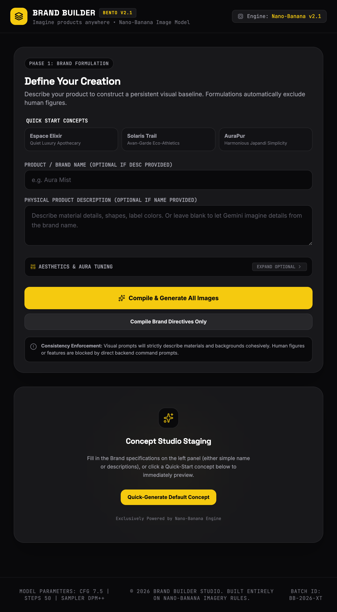

# 🎨 Brand Builder

> An AI-powered brand visualization studio that imagines your product across billboards, newspaper ads, and social posts — with consistent aesthetics generated by the Gemini API and Nano-Banana image engine.

---

## 🚀 Live Demo

> _Built as part of the [Google AI Professional Certificate](https://grow.google/certificates/)_

---

## ✨ Features

- **Multi-Medium Brand Visualization** — Generate your product across three distinct advertising formats in one click: widescreen Billboard (16:9), Newspaper Ad (3:4), and Social Post (1:1)
- **AI Brand Formulation** — Gemini Flash analyzes your product name, description, color palette, and aesthetic identity to produce consistent, medium-specific image prompts
- **AI Image Generation** — `gemini-2.5-flash-image` (Nano-Banana engine) renders photorealistic product mockups with enforced no-human composition rules
- **Smart Input Derivation** — Leave fields blank and the AI invents a compelling product name or rich physical description automatically
- **Prompt Customization** — Edit any generated prompt directly before rendering for full creative control
- **Quick-Start Presets** — Three built-in brand concepts (Quiet Luxury Apothecary, Eco-Athletics, Japandi Minimalism) to instantly explore the full pipeline
- **Intelligent Fallback System** — If the Gemini API quota is exhausted, a high-precision local design engine generates structured brand prompts offline
- **Bento UI Layout** — Dark editorial interface with animated loading states, aspect-ratio-accurate mockup frames, and a styled newspaper masthead mockup

---

## 🛠️ Tech Stack

| Layer | Technology |
|---|---|
| Frontend | React 19, TypeScript, Tailwind CSS v4 |
| Backend | Node.js, Express |
| AI (Text) | Google Gemini Flash (`gemini-3.5-flash`) |
| AI (Image) | Google Gemini Image (`gemini-2.5-flash-image`) |
| SDK | `@google/genai` v2.4 |
| Build Tool | Vite 6 |
| Animation | Motion (Framer Motion) |
| Icons | Lucide React |

---

## 📁 Project Structure

```
brand-builder/
├── src/
│   ├── App.tsx          # Full UI — form, presets, prompt panels, mockup gallery
│   ├── types.ts         # TypeScript interfaces (BrandProduct, PromptSet, AdShot)
│   ├── index.css        # Global styles
│   └── main.tsx         # React entry point
├── server.ts            # Express backend — prompt generation + image generation APIs
├── index.html
├── vite.config.ts
└── package.json
```

---

## ⚙️ Getting Started

### Prerequisites

- Node.js v18+
- A [Gemini API key](https://aistudio.google.com/app/apikey) (free)

### Installation

```bash
# 1. Clone the repository
git clone https://github.com/RJ1899157/brand-builder.git
cd brand-builder

# 2. Install dependencies
npm install

# 3. Set up your environment variables
cp .env.example .env.local
# Add your Gemini API key to .env.local:
# GEMINI_API_KEY=your_key_here

# 4. Start the development server
npm run dev
```

The app will be available at `http://localhost:3001`

### Production Build

```bash
npm run build
npm start
```

---

## 🧠 How It Works

```
User Input (name, description, color, style)
        ↓
POST /api/brand/generate-prompts
        ↓
Gemini Flash → JSON: { billboardPrompt, newspaperPrompt, socialPrompt, slogan, productSummary }
        ↓
POST /api/brand/generate-image (x3 in parallel)
        ↓
gemini-2.5-flash-image → base64 PNG → rendered in UI mockup frames
```

### Consistency Enforcement
Every image prompt carries the same physical product baseline (materials, colors, label details) and enforces **no human figures** via backend prompt injection — ensuring all three ad formats look like they belong to the same campaign.

---

## 📸 Screenshots



> Local app preview after running `npm run dev` on port `3001`.

---

## 🔑 Environment Variables

| Variable | Description |
|---|---|
| `GEMINI_API_KEY` | Your Google Gemini API key (required) |

---

## 📄 License

MIT License — free to fork and build on top of.

---

## 👤 Author

**Rishabh Jain**
- GitHub: [@RJ1899157](https://github.com/RJ1899157)
- LinkedIn: _(add your LinkedIn URL)_
